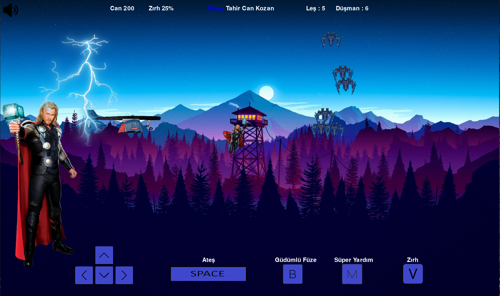

# Gökyüzü Savaşçısı - Basit 2D Uçak Oyunu

Bu, Python ve Pygame kütüphanesi kullanılarak geliştirilen basit bir 2D uçak oyunudur. Oyun, oyuncunun gemisiyle düşman gemilerinden kaçmasını ve düşmanları yok etmesini sağlar.

## Nasıl Oynanır

- Oyun, gemiyi yönlendirmek için klavye tuşlarını kullanır.
- "Space" tuşuyla ateş edebilirsiniz.
- "M" tuşuyla farklı süper kahramanları çağırabilirsiniz.
- "B" tuşuyla süper güç kullanabilirsiniz.
- "V" tuşuyla zırhı aktifleştirebilirsiniz.

## Oyun Ekranı Görüntüsü



## Gereksinimler

- Python 3
- Pygame kütüphanesi

## Kurulum

1. Bu depoyu yerel makinenize klonlayın veya ZIP olarak indirin.
2. Python ve Pygame yüklü değilse, [Python'un resmi web sitesinden](https://www.python.org/downloads/) Python'u ve ardından aşağıdaki komutu kullanarak Pygame'i yükleyin:

```bash
pip install pygame


  


  
